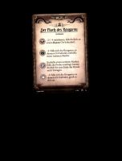
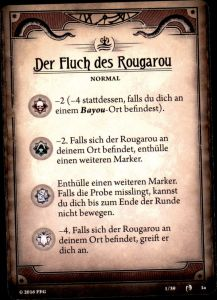
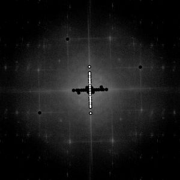
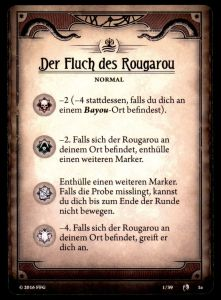
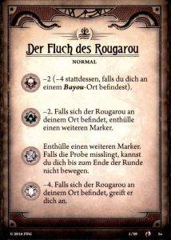
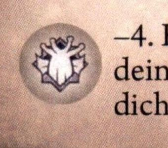
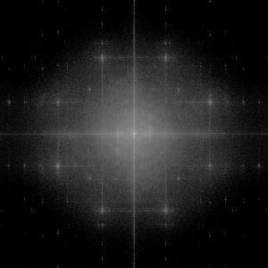
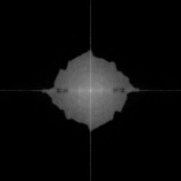
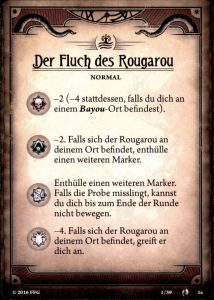
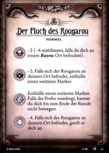

# scan2mint
An automated process for improving scanned game and sports cards

## Introduction
This repository builds an Docker container. The container watches a source directory for freshly scanned images and takes each image through a multi stage imaging process. The result will be placed inside a destination directory the source file will then be __deleted__.

## Docker

* Bind a source volume to the `/app/source` directory inside the container. This is where the source images will be placed. i.e. add this to your docker run command line: ` --mount type=bind,source=/mysmbshare/scan/source,target=/app/source`
* Also bind a destination volume to `/app/destination`. The container will write the processed images there. i.e. add this to your docker run command line: `--mount type=bind,source="$(CURDIR)"/source,target=/app/source`
* Optionally you can set an environement variable `NUMPROCESSES` to the maximum number of processes the container may spawn simultaneously. __WARNING__: If you set this to value higher value than the available cores/threads in your host maschine, this will likely result in a high load on the host. The default is set to 4.
* Also you can set `BLOCKSIZE` to the amount of images the container should process at the same time. The default is set to 100. See more on this in the processing section below.

## Usage

My personal scan process starts by scanning the images through a document feeder scanner (*Fujitsu FI-7160*) in 600dpi without any color or image corrections. In the `source` directory (and below) you may find an `example.jpg` of a scanned image. This example has multiple issues, where each stage tries to correct one of them.

### stage0
This stages does nothing but copy the images from the source directory without any modification. This is done to ensure that the processing is not influenced by any file locks from an image viewer or other process still working in the source directory.

### stage1
The `example.jpg` has a wide black area around the actual image. As i scan with a fixed A6 document size in uncompressed `.tif` format, this results in a very large file (40MB). The first stage will automatically crop the image to reduce the file size and thus resulting in fewer pixels to process in later stages. There are some CPU intensive calculations to me made in later stages, which will scale on number of pixels. Removing excess pixels from the image will speed up the following stages significantly. To ensure that the crop doesn't eat into the actual image, the fuzz value will be set to a very low value.

| source                                                                | stage1                                                      |
|-----------------------------------------------------------------------|-------------------------------------------------------------|
||        |

This is the same as calling the following imagemagick script

     autotrim -c southwest -f 5 source/example.jpg stage1/example.jpg

### stage2
The image now needs some rotation. The scanner i use does have hardware and software correction mechanism for this problem. I found that both features do a great job with ordinary office documents, but not on the cards i have to scan. The cards often have black horizontal and vertical lines, which are the same color as the card background. The scanner hardware and software solution needs to crop when deskewing an image to prevent a white background showing up. This auto cropping tends to eat into my scans from time to time. Among Freds script is one calles textdeskew which does a Fourier Transformation and automatically identifies bright hot spots in the resulting map (marked with black dots). As text is usually printed in parallel lines, these hotspots should form a line in the map as well. He does a (recursive, sort of) linear regression to identify this line and the rotation angle from the y-axis. This works perfect on text only scans as you can see on his homepage. But on cards there tends to be more graphics than text and the original `textdeskew` fails on these images. I modified his script a little to cope with this problem. As you can see in the example FFT Map, a lot of black circles are way off the single line. My modification calculates a virtual line for each hot spot through the center point of the map. For this line the std deviation is calculated against each other hot spot. To accumulate for vertical text and artifacts each hot spot is rotated by 90deg around the center point. It's std deviation is calculated against the virtual line as well. If the orginial hot spot has a std deviation of less than two, it is used for further calculation. Otherwise the 90deg rotated hot spot is checked for a std deviation of less than two and used appropiatly. For each virtual line the number of hotspots (original and 90deg rotated) with a std deviation of two or less is counted. The virtual lines with the highest score is then used to feed these nearby hot spots (std dev < 2) into Freds linear regression. These "winning" hot spot are then marked with a smaller white dot. A white dot within a larger black dot denotes an orginal hot spot, while a single white dot representis a 90 deg rotated hot spot.

| stage1                                                          | map                                                    | stage2                                               |
|-----------------------------------------------------------------|--------------------------------------------------------|------------------------------------------------------|
| |  | |

The modified script is in `src/scripts` and is called the following way:

    deskew -c black -n 40 -t 10 -a 100 -r 20 stage1/example.jpg stage2/example.jpg

### stage3
With a straight image the rest of the black border can be easily cropped. Same script as in stage1, but with a higher fuzz value. The cropping is less likely to eat into the image with clear straight edges.

| stage2                                                                | stage3                                                      |
|-----------------------------------------------------------------------|-------------------------------------------------------------|
|       |        |

The following command line is used:

     autotrim -c southwest -f 35 stage2/example.jpg stage3/example.jpg

### stage4
A scanned image is just the digital representation on an analog medium, which in turn was produced from a digital source. While a monitor is capable of producing millions of colors (at least in theory), a printing press is not. Here the printing usually is done via rolling presses, one for each color (cyan, magenta, yellow and black) on white paper. The blending of different colors is done by halftoning each rolling press. Under a magnifying glass this can be seen as dither like patterns. When scanning such a print, it can lead to moiré like patterns. Some people suggest scanning the card on a flat bed scanner several times while rotating the card slightly on the glass between each scan. Afterwards you can manually crop and derotate the images. Then, in gimp or photoshop, put them in layers precisely above each other and calculate a median between all layers. While this gives good results, this can't be done in an automated process. Here again i found a script in Freds library: `notch`. It transforms an image via FFT into its frequency domain. Here, each regular patterns show as star like objects. These can be filtered out and the resulting map can be applied to the image without losing to much sharpness in the process.

| stage3 (image and FFT-Map before processing)                          | stage4 (image and FFT-Map after processing                          |
|-----------------------------------------------------------------------|---------------------------------------------------------------------|
|        |      |
|    |  |

The call to notch including parameters:

    notch -c 200 -v 3 -h 2 -d 30 -s 25 stage3/example.jpg stage4/example.jpg

### stage5
As the card i scan are mostly dark in tone, they tend to lack brighter parts in the histogram. Typical filter relying on spreading the histogram evenly between the black & white extremes tend to falsify the image. Especially with this card game a dark tone is most approiate to the setting of the game. My experiments with other color correcting script from Freds homepage lead to mixed results. So i choose a slight autocolor correction in favor for a little cooler (from a color perspective) but still dark look.

| stage4                                                                | stage4                                                        |
|-----------------------------------------------------------------------|---------------------------------------------------------------|
|       |  |

    autocolor stage4/example.jpg stage5/example.jpg

### stage6
soon tm

### stage7
soon tm

# Processing order

The container will scan the input directory for new files and add them to a queue. When a new file is detected the container will wait for three seconds to detect if more files are being added to the queue. Only when for a time period of three seconds no new files are detected, the processing will start. Up to a maximum of `BLOCKSIZE` files will then pushed through several stages of processing. All the images will be pushed through a stage, before processing to the next stage. Thus if you put a lot of files into the source directory, it will take a very long time before the first image shows up in the destination directory. If this bothers you, i'll suggest to start with small (if not single) batches of files first.

## Licensing
No commercial use allowed. Most off the imagemagick wizardry is done through bash scripts from the cretive work of [Fred Winehouse](http://www.fmwconcepts.com/imagemagick/index.php). Please check his licensing terms for more information.

